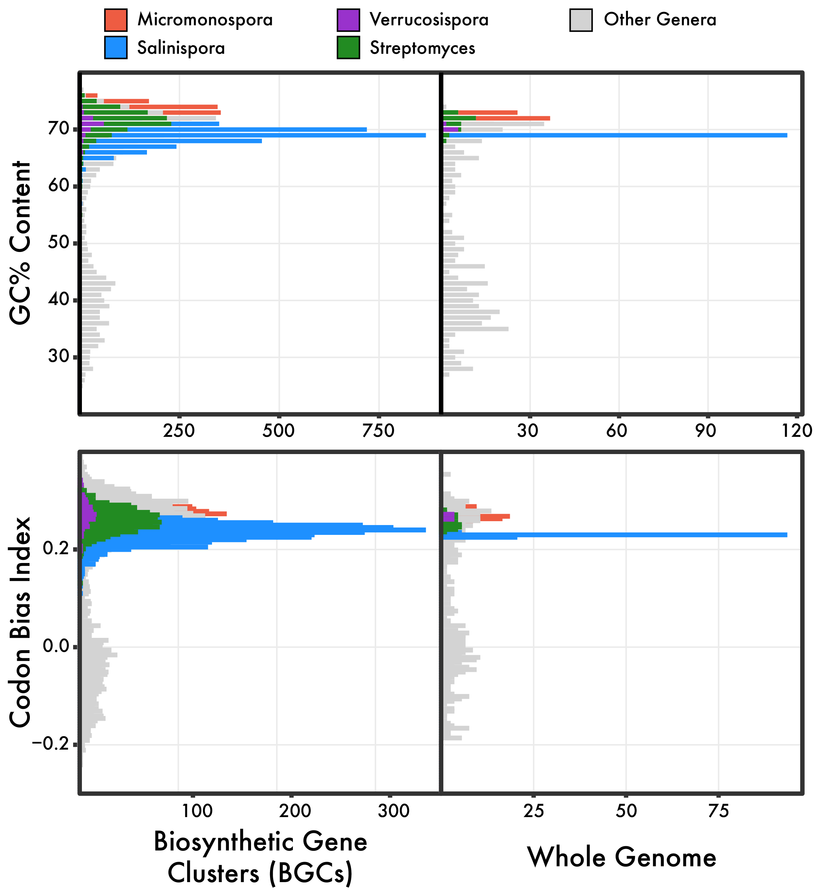

# BGC Survey

## Comparisons of number of BGCs

From the flexible gene content, Salinispora species-specific genes were linked to biosynthetic gene clusters (BGCs). Before we move on, we wanted to see if Salinispora was unique in any way with its BGC signature. Salinipsora has been a well-studied model system for natural product discovery, but it is unclear how its biosynthetic potential stacks up to other genera.

We downloaded 589 genomes from the [PATRIC database](https://www.patricbrc.org/) that were deemed "representative genomes" from well-characterized genera across the Bacterial domain.

We included all genomes from the Micromonosporaceae family for direct comparisons to Salinispora, and also included more robust sampling in other well-known bioactive genera (i.e., Moorea and Streptomyces).

First, we screened each genome for 21 conserved phylogenetic marker genes, and used a representative strain from each genera to constuct a multi-locus phylogeny.

Next, we took all genomes containing the 21 marker genes ("passed genomes"), and identified BGCs with antiSMASH v5. We calculated the percent of the genome dedicated to secondary metabolism (# of bp in BGCs / # of bp in genome), as well as the number of BGCs in total.

  

Although, Moorea, Streptomyces, and Kitasatospora contained more BGCs than all other genera we screened, after standardizing for genome size, Salinispora contained the most BGCs as a function of its genome size at a whooping 18% of its genome dedicated to BGC and metabolite production. Other general patterns were a pronounced uptick in the number of BGCs in the Actinobacterium phylum, suggesting BGCs may be a conserved trait across the phyla.

## Comparisons of number of BGCs

A prevailing idea in the field of natural products is that BGCs are rampantly exchanged. Further, previous work in Salinispora has identified Streptomyces and Verrucosispora as a source for HGT BGC exchange.

So, I quickly screened %GC and codon usage biases of identified BGCs and compared across genera and to the genome average. These Salinispora genomic metrics for BGCs seem to match the genome average quite well. Not conclusive but appears that BGCs are conserved and not acquired by foreign genera.

  

