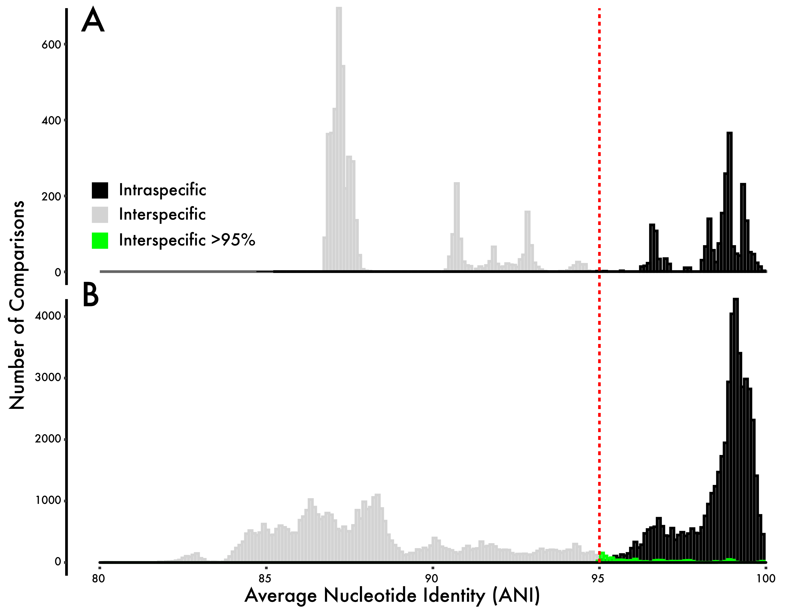

What we really want to do is first resolve the idea in the field of Natural Products, that BGCs are frequently horizontally transferred.

This idea would convolute phylogenetic signals with relations to the BGCs. For instance, a recently transferred BGC should have high genetic similarity to the donor strain.

The first thing we can do is simply perform pairwise average nucleotide analyses to compare strains and compare this output to the genetic similarity of BGCs.

# Genome-wide ANI v. BGC ANI

Not even comparing outside the Salinispora genus, if BGCs are being "passed around", they should have ANI signatures that deviate from the expected genome-wide comparisons.

First, we use the [enveomics](https://github.com/lmrodriguezr/enveomics) package to perform pairwise genome comparisons for the 118 strains. Not surprisingly, we see a clear discontinuity of ANI values at 95%. This is the expected species-level delineation for genome similarity (Panel A below).

Now let's use all the BGCs that were identified by [antiSMASH v5](https://antismash.secondarymetabolites.org) - [link to files](../antismash5/) to perform a pairwise comparison.

Just for reference, you can run the antisSMASH commands locally to bypass waiting over their website and refraining from submitting 118 genomes individually. They should run within a couple minutes for each genome.

```bash 
for genome in *.gbk
do
	antismash $genome
done
```

We can convert each of these genbank files to fasta files and run ANI analyses. 

However, since Salinispora has a lot of genomes (118 genomes), and each genome has a lot of BGCs (average of 25 per genome), this makes A LOT of pairwise comparisons for the BGCs (3041! comparisons). I migrated this section to a supercomputer and parallelized to run 32 comparisons at once - see script [here](./bgccomp.sh).

This will be out first attempt to establish this as we are comparing BGCs blindly (just seeing whether they hit another BGC at some similarity level).

## Results

When we look at the results (Panel B), we see the interspecies v. intraspecies comparisons holds up extremely well! We see a delineation at 95% ANI again demarcating species boundaries. However, this time we see some BGCs filling in this gap, suggesting these BGCs may have been recently transferred (highlighted in green). These are definitely the exception, rather than the rule as only 1.4% of the comparisons fail to follow the species delineation. And of these 1.4% the average ANI was 96.5%, further suggesting that these were relatively distant transfer events.

<p align="center">
  
</p>

Again, this was a pretty coarse way to assess HGT of the BGCs, the rest of the project will go into further depth. And even the ones with elevated ANI values may just be BGC fragments hitting a conserved BGC region within Salinispora. This is a nice start but a long ways to go!


