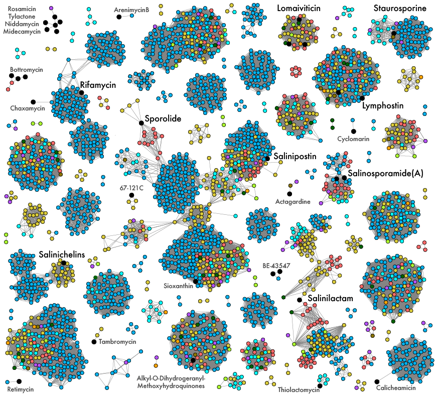

## Identification of biosynthetic gene clusters

Annotated genomes from PROKKA were passed through antiSMASH v5 for the identification of BGCs. 

The resulting output was fed to BiG-SCAPE to dereplicate BGCs into gene cluster families (GCFs) and match with known BGCs in the curated MIBIG database.

```bash
python $BIGDIR/bigscape.py \
-i input_files \
-o bigscape_out \
--pfam_dir $PFAMDIR \
-c 6 --mibig --cutoffs 0.3 \
--clan_cutoff 0.3 0.7 \
--mix --no_classify
```

BiG-SCAPE computes a similarity score between each pairwise BGC. This data can be used to visualize the network (this is the final network but we will walk through other stuff first). Each node is a BGC colored by the species of the strain. Black nodes are MIBIG refernce clusters with names of the reference BGC. Edges connecting nodes reflect similarity scores computed by BiG-SCAPE.

<p align="center">
  
</p>

Previously, [Letzel et al.](https://doi.org/10.1111/1462-2920.13867) used antiSMASH v2 and another method (mainly clustering BGCs into "OBUs" by the KS and C domains in PKS and NRPS gene clusters, respectively), Salinispora was described to have 176 OBUs (operational biosynthetic units) with 115 of BGCs found in >2 strains. This can be a relative baseline for us.

The main parameters to set in BiG-SCAPE will be the GCF cutoffs (in the above script c=0.3).

From previous analyses by AB Chase at the beginning of this project, using antiSMASH v4 as the input, this can have effects on the GCF calling:

| cutoff value    | GCFs      | Method |
| --------------- |:---------:| -----:|
| 0.15 | 502 | Not Mixed |
| 0.3  | 431 | Not Mixed |
| 0.5 | 407  | Not Mixed |
| 0.3 | 367  |  Mixed |

All of these cases (anything higher was too many connections between nodes) are WAY higher than Letzel et al. - not too surprising that it's higher with newer software, but it's a lot!

The other parameter we can change is the "mixed" option to not use the antiSMASH BGC designations to *a priori* group BGCs. Getting better!

Conveniently during analysis, antiSMASH v5 came out - what timing!!! So we re-ran the genomes through and called GCFs again

## Identification of biosynthetic gene clusters (attempt 2 with antiSMASH v5)

1. Input is 3041 BGCs from 118 Salinispora genomes (~26 BGCs per strain)
2. Add MIBIG clusters
3. Mixed assignments

**RESULT 305 GCFs**

The first thing we noticed was that GCFs were often splitting known BGCs into multiple GCFs. For instance, lomaiviticin was known to be produced in 2 Salinispora species, each clustering into distinct GCFs. However, when we view the network, we see all of them cluster very nicely and we find a few new species with the BGC. 

Now, we figured we had two options to address this.
1. Experiment more with the cutoff score. BUT, this is almost impossible to fine-tune across all BGC types (e.g., NRPS, PKS, etc.)
2. Use the network to further group BGCs into network modules (or BGC communities)

With a resolution of 1.0, we achieved a modularity of 0.927 and this equated to 206 BGC communities.

So, in summary we have 305 GCFs and 206 BGC network communities - both numbers not too far off from Letzel et al.

Using some multivariate stats, we can visualize both of these designations in a NMDS plot:

<p align="center">
  
</p>

Both methods show similar results with species largely clustering together based on their BGC profiles - AMAZING!!!
