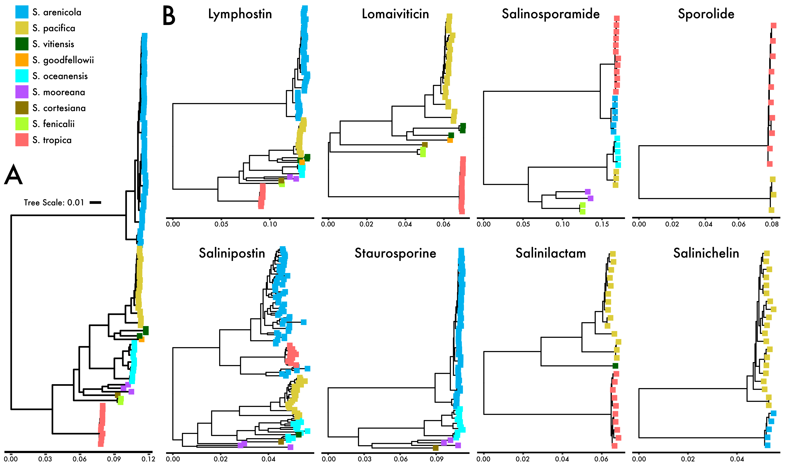

# Evolutionary Processes 

We wanted to evaluate alternative processes contributing to BGC evolution. To start, we computed whole-BGC alignments using [MUGSY](http://mugsy.sourceforge.net/)

```bash
mugsy --directory ${OUTDIR} --prefix ${BGC} *.fasta

cd $OUTDIR
## Extract the longest alignment, e.g., the first LCB (locally co-linear block)
maf2fasta.pl 1 < ${BGC}.maf > ${BGC}.fasta

## now need to remove \"= sign\" from end of files 
grep -v "=" ${BGC}.fasta > mugsy_out/${BGC}.aln
```
## BGC Phylogenies and Recombination

We can use this alignment to build a whole-BGC phylogeny

```bash
## first need to rename the reads from mugsy
grep '>' mugsy_out/${BGC}.aln | sed 's/>//g' | cut -f1 -d' '> temp.txt
cut -f1 -d'.' temp.txt > temp2.txt
paste temp.txt temp2.txt > newnames.txt
fasta-rename.py mugsy_out/${BGC}.aln newnames.txt ${BGC}.final.fa

raxml -s ${BGC}.final.fa -m GTRGAMMA -n ${BGC}BGC -x 100 -# 100 -p 4321 -f a -T 4
```

Now, it's just a simple manner of using [ClonalFrameML](https://github.com/xavierdidelot/ClonalFrameML) to calculate the recombination metrics.

```bash
ClonalFrameML RAxML_bipartitionsBranchLabels.${BGC}BGC ${BGC}.final.fa ${BGC}BGC &> out
```

Now, we can use the same phylogenies and utilize a DTL model with [Notung](http://www.cs.cmu.edu/~durand/Notung/) to infer duplications, transfer, and loss events. Run through 10 rooted phylogenies and select the most parsimonious output.

```bash
## set parameters
LOSS=1.0
TRANS=3.0
DUP=2.0

## first generate the top 10 parsimonious rooted trees and then can analyze each
java -jar $NOTDIR/Notung-2.9.1.2.jar \
	-g RAxML_bipartitionsBranchLabels.${BGC}BGC \
	-s RAxML_boot.core.root.tre \
	--root --speciestag prefix \
	--costdup $DUP --costloss $LOSS \
	--maxtrees 10

for (( i = 0; i <= 9; ++i ))
do
	java -jar $NOTDIR/Notung-2.9.1.2.jar \
	--reconcile --speciestag prefix \
	--costdup $DUP --costloss $LOSS \
	--infertransfers true --costtrans $TRANS \
	--parsable --treeoutput newick \
	-g RAxML_bipartitionsBranchLabels.${BGC}BGC.rooting.${i} \
	-s RAxML_boot.core.root.tre 
done
```

## Phylogenetic Visualization

Finally, we can output a visualization of the phylogenies in R with species metadata:

```R
library(ape)
library(ggtree)

tr <- read.tree(file = paste('RAxML_bipartitionsBranchLabels.', BGC, 'BGC', sep = ''))
data <- read.table('genomeID.txt', header = T, sep = "\t", comment.char = "")
taxcolors <- setNames(as.character(data$clade_color), data$clade_name)

library(phytools)
tr2 <- midpoint.root(tr)

library(ggplot2)
#pdf(file = "coregenome-raxml.pdf", height = 12, width = 4)
t <- ggtree(tr2, layout="rectangular") 
t %<+% data + 
  geom_tippoint(aes(colour = clade_name, size = 3, shape = clade_name)) +
  scale_color_manual(values = taxcolors) +
  scale_shape_manual(values = rep(15, length(unique(data$clade_name)))) +
  theme_tree2() +
  geom_treescale(width = 0.01)
```

Put them altogether in Illustrator and we can visualize all the BGC phylogenies in reference to the core genome.

<p align="center">
  
</p>

You will notice the branch lengths scale on these, and we can use this information to correlate the BGC phylogenetic distance to the core genome:

```R
coretree <- read.tree("RAxML_bipartitionsBranchLabels.salinicore")

# convert to distance matrix
PatristicDistMatrix <- cophenetic(coretree)

library(reshape2)
B <- melt(PatristicDistMatrix, varnames = c('genome1', 'genome2')) 
phylodist <- B[!is.na(B$value),]
names(phylodist) <- c("genome1", "genome2", "phylodist")

totaldist <- merge(phylodist, BGCdist, by = c("genome1", "genome2"))
```

...and do this for each BGC phylo and match based on the genome1 and genome2 columns - done!

